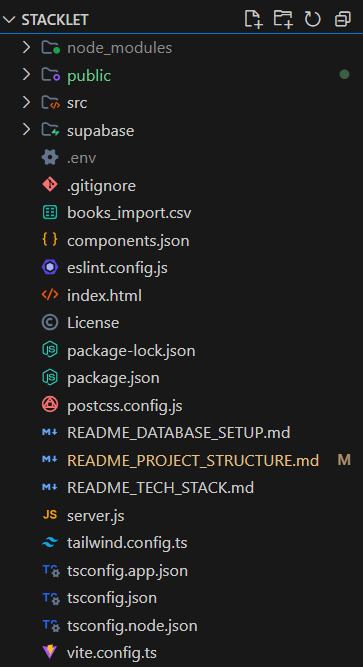
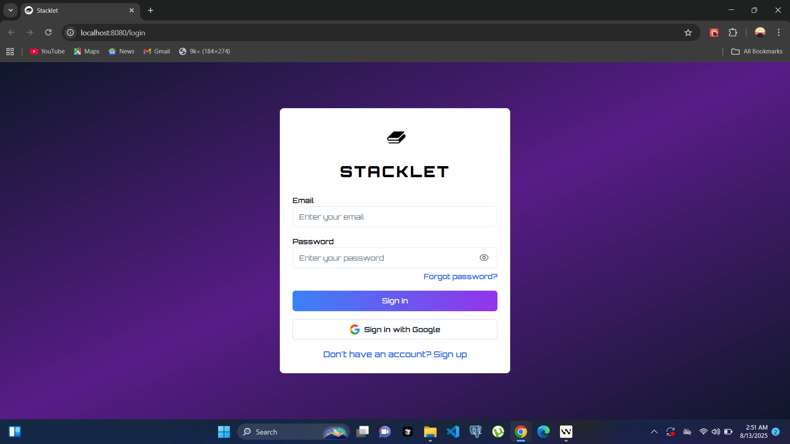

# 📚 STACKLET – Personal Book Library Organizer

[](https://react.dev/)
[](https://www.typescriptlang.org/)
[](https://vitejs.dev/)
[](https://supabase.com/)


A modern, full-stack web application for **organizing your personal book collection**, built with **React 18**, **TypeScript**, and **Supabase**.

---

## 📁 Project Structure
The app follows a **modular, scalable** file structure separating components, pages, services, hooks, and types.  
📄 Detailed each file structure → [README_PROJECT_STRUCTURE.md](README_PROJECT_STRUCTURE.md)




---

## 🎥 Demo

### Screenshot


### Demo Video
You can find the demo video on my [LinkedIn post](https://www.linkedin.com/in/syed-ammar-5167a42b1).

---

## ✨ Features

- 📖 **Book Management** – Add, edit, delete, and view your collection.
- 🔍 **Search & Filter** – Search by title/author, filter by genre/category.
- 📊 **Sorting** – Sort by date, title, author, or rating.
- 📥 **Bulk Import** – Bulk import books via CSV files.
- 🔐 **Authentication** – Email/password + Google OAuth.
- 📱 **Responsive Design** – Fully responsive on desktop and mobile.
- 🎨 **Smooth UI** – Tailwind + shadcn/ui + Radix UI + Framer Motion.

---

## 🛠️ Tech Stack

**Frontend:** React 18, TypeScript, Vite.  
**Styling:** Tailwind CSS, shadcn/ui, Radix UI.
**Backend:** Supabase (PostgreSQL + Auth).  
**State Management:** TanStack React Query.  
**Forms & Validation:** React Hook Form + Zod.  
**Animations:** Framer Motion.  
**Routing:** React Router DOM (Protected Routes).  

📄 Full breakdown → [README_TECH_STACK.md](README_TECH_STACK.md)

---

## 🚀 Quick Start

### 1️⃣ Clone the Repository
```bash
git clone https://github.com/Syed-Ammar-21/STACKLET.git
cd STACKLET
```

### 2️⃣ Install Dependencies
```bash
npm install
```

### 3️⃣ Set Up Environment Variables
Create a `.env` file in the project root directory and add:
```env
VITE_SUPABASE_URL=your-supabase-url
VITE_SUPABASE_ANON_KEY=your-supabase-anon-key
```
📄 Database setup guide → [README_DATABASE_SETUP.md](README_DATABASE_SETUP.md)

### 4️⃣ Start the Development Server
```bash
npm run dev
```

### 5️⃣ Open in Browser
```
http://localhost:8080/
```

---

## 🤝 Contributing
Contributions are welcome!

1. **Fork** the repo  
2. **Create a new branch**
   ```bash
   git checkout -b feature/your-feature-name
   ```
3. **Commit changes**
   ```bash
   git commit -m "Add your message"
   ```
4. **Push to branch**
   ```bash
   git push origin feature/your-feature-name
   ```
5. **Submit a Pull Request**

---

## 📜 License
This project is licensed under the **MIT License** – see the [LICENSE](LICENSE) file for details.

---

## 📌 Author
**Syed Ammar Zulfiqar**  
If you found this project helpful, please **star ⭐ the repository**!
